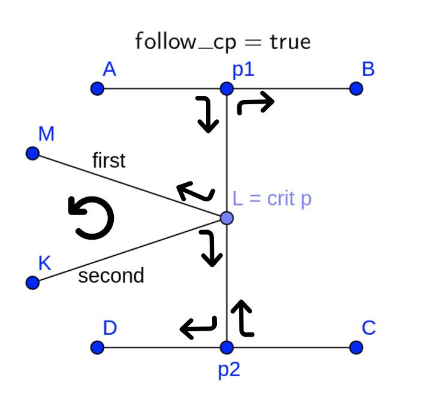
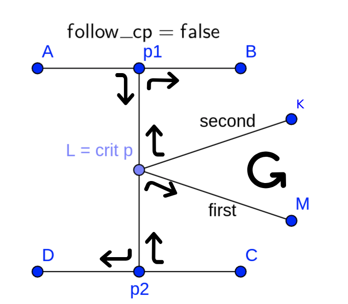
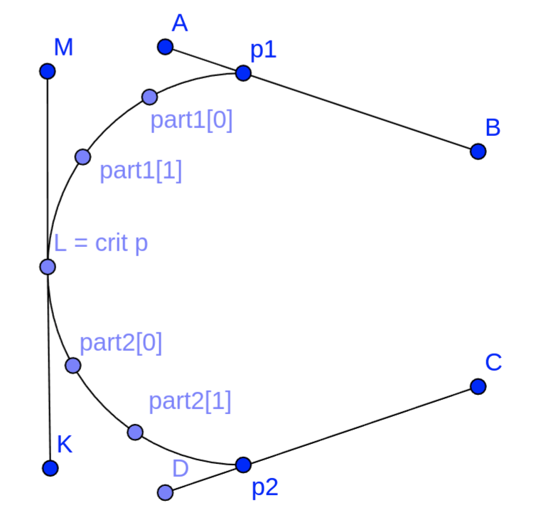

# Note for whoever decided to change this code (we feel sorry for you)

# Approximate cellular decomposition
``Ogre::Vector2`` is used  to store indices of grid cells. It is not a good 
container for storing indices as ``Ogre::Vector`` is composed of ``float`` 
numbers, but it should not cause any troubles as grid size is not that big.  

Known issues: 
 - The last cells of perfectly rectangle grid often turn to be invalid.

## Stride method
The code is an implementation of "Path Planning for Rapid Aerial Mapping 
with Unmanned Aircraft Systems" by Eduard Santamaria et. al. It does not 
use any heuristic to determine next direction if strides int several directions have same lengths.

# Exact cellular decomposition

``Point2d``, ``Line``, ``Ring`` and ``Polygon`` are types registered in 
``boost::geometry`` (viz 
https://www.boost.org/doc/libs/1_84_0/libs/geometry/doc/html/index.html)  
``Ogre::Vector3`` is only used for denoting infinite lines in 2d plane 
(vector.x * X + vector.y * Y + vector.z = 0)  
``point_t``, and ``cell_t`` are types defined in diagonal_decomposition.h 
and morse_decomposition.h for more convenient computations of the algorithms.

If points are written in ``std::vector<point_t>``, the last and the first 
vertices are not equal. They are equal if points are in ``Polygon`` or ``Ring``

Known issues:
 - getPath() can be optimized with A* algorithm
 - fixPath() does not delete waypoints that lie on the same infinite line

## Diagonal decomposition

The code in diagonal_decomposition.h is an implementation of "A practical 
algorithm for decomposing polygonal domains into convex polygons by diagonals" 
by Jose Fernandez et al. with further coverage path planning described in 
"Coverage path planning with unmanned aerial vehicles for 3D terrain 
reconstruction" by Marina Torres et al. However it's worth noting that Marina 
Torres et al. propose considering all possible permutations of partitions, 
while function findPath() follows DFS and visits not adjacent cells iff
all adjacent ones have been visited (if any).  
Polygon decomposition algorithm is MP3 and can be upgraded to MP4 or MP5 both 
with merging process.

Known issues:
 - generatePath() does not add heading to the references
 - findPath() iterates over all possible permutations, which has O(n! * 4^n) time complexity.
 It crashes even if n=8
 - getIntersection() may return invalid result due to inaccuracy of float type.
 - If partition is too small, no coverage path is planned within it.

## Morse decomposition

The code in morse_decomposition.h is an implementation of "Morse Decompositions
for Coverage Tasks" by Ercan U. Acar et al. Since such decomposition depends on
chosen Morse function, it was decided to use $f(x) = a*x_1 + b*x_2 + c$  
However the implementation can be extended with other functions, it is only 
needed to override virtual methods properly. Notes, that are designed to help 
you do it, follow in the next section.

Worth noting:
 - findPath() follows DFS and visits not adjacent cells iff all adjacent ones 
 have been visited (if any).
 - In order to get rid of edge cases of searching for (and further processing
 of ) critical points, a small random noise is added to every vertex of the 
 polygon.

Known issues:
 - generatePath() does not add heading to the references
 - getIntersection() may return invalid result due to inaccuracy of float type.
 - If critical point is not already in the polygon (i.e. lies on one of the 
 edges), behaviour is undefined.

### How to use and initialize edge_t
``edge_t`` represents 2 new edges (or sequences of edges) that divide the 
polygon into partitions. Individual attributes of it are demonstrated in the 
picture below.

Right-angled arrows show how individual partitions go, and rotating arrows show
direction of vertices of a boundary. Note that ``edge_t.first`` and 
``edge_t.second`` have different positions in different variants. 

If morse function is a linear slice, ``edge_t.part1`` and ``edge_t.part2`` 
are not used, however they are crusial if edges are not straight. 
Generally, ``edge_t.part1`` must follow order from ``edge_t.p1`` to 
``edge_t.crit_p``; and ``edge_t.part2`` from ``edge_t.crit_p`` to ``edge_t.p2``
Pictures below show how they must be initialized in case of 
$f(x) = x_1^2 + x_2^2$ Morse function. 
Note that in such case vertex L does not have to exist in original polygon.

Once each ``edge_t`` is properly initialized, the algorithm is (almost 
certainly) able to divide the polygon into partitions.
Also pay attention to filling ``point_t``. You do not have to fill
``point_t.id`` of critical points ( in getCriticalPoints() ), ``edge_t.p1`` 
and ``edge_t.p2`` ( getEdge() ) as the algorithm defines them after insertion 
into the polygon, <ins>but it is crucial to fill</ins> ``point_t.prev_point`` 
so the algorithm knows where they belong. E.g. ``p1.prev_point`` must 
be ``indexOf(A, ring)`` (view pictures) independently if there are any other new 
points between ``A`` and ``p1``.

I hope You found these notes helpful. However it is not garanteed that the 
code does not have bugs and if you are certain, that you initialize attributes 
correctly but it still does not work, try studying the implementation of the 
algorithm.
